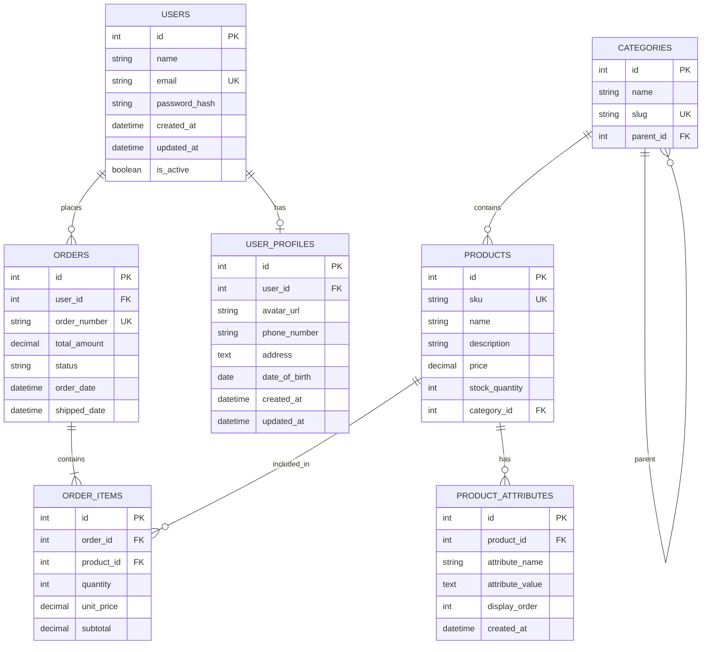
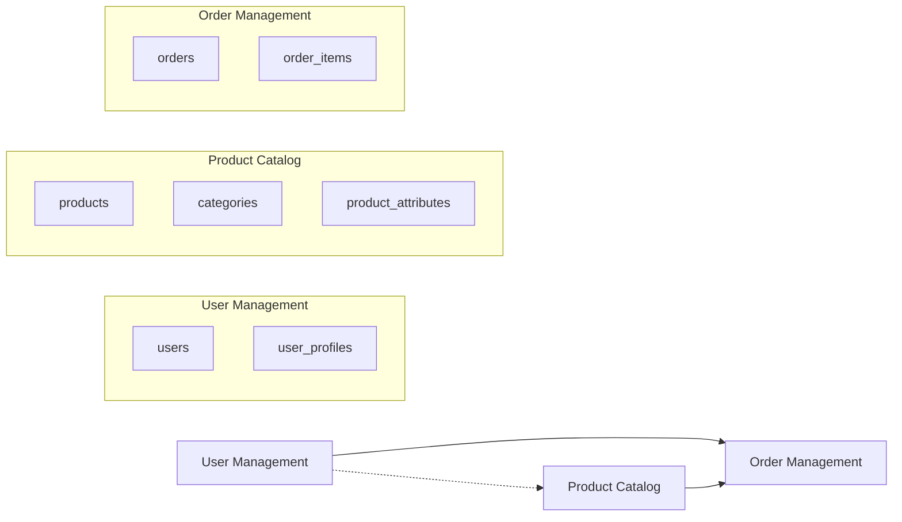

# DDL Context Analysis

## 1. Database Overview

- **Database Engine**: PostgreSQL
- **Total Tables**: 7
- **Total Relationships**: 6 foreign key relationships
- **Schema Version**: 1.2 (incremental migrations from v1.0)

### Business Domain Summary

| Domain | Tables | Description |
|--------|--------|-------------|
| User Management | `users`, `user_profiles` | Authentication, profiles, and role-based access |
| Product Catalog | `products`, `categories`, `product_attributes` | Product inventory, categorization, and specifications |
| Order Management | `orders`, `order_items` | Order lifecycle, items, and fulfillment |
| Payment | _(handled externally via Stripe/PayPal)_ | No dedicated payment table in current DDL |

---

## 2. Entity Relationship Diagram



### Relationship Summary

| From | To | Type | FK Column | Constraint |
|------|----|------|-----------|------------|
| `user_profiles` | `users` | Many-to-One | `user_id` | `ON DELETE CASCADE` |
| `orders` | `users` | Many-to-One | `user_id` | - |
| `products` | `categories` | Many-to-One | `category_id` | - |
| `categories` | `categories` | Many-to-One (self) | `parent_id` | - |
| `order_items` | `orders` | Many-to-One | `order_id` | - |
| `order_items` | `products` | Many-to-One | `product_id` | - |
| `product_attributes` | `products` | Many-to-One | `product_id` | `ON DELETE CASCADE` |

---

## 3. Entity Definitions

### 3.1 `users`

**Purpose**: Core user table for authentication and basic identity.

| Column | Data Type | Nullable | Default | Constraints |
|--------|-----------|----------|---------|-------------|
| `id` | `SERIAL` | NO | auto-increment | **PK** |
| `name` | `VARCHAR(100)` | NO | - | - |
| `email` | `VARCHAR(255)` | NO | - | **UNIQUE** |
| `password_hash` | `VARCHAR(255)` | NO | - | - |
| `created_at` | `TIMESTAMP` | NO | `CURRENT_TIMESTAMP` | - |
| `updated_at` | `TIMESTAMP` | NO | `CURRENT_TIMESTAMP` | - |
| `is_active` | `BOOLEAN` | NO | `true` | - |

**TypeScript Interface**:
```typescript
interface User {
  id: number;
  name: string;
  email: string;
  passwordHash: string;
  createdAt: Date;
  updatedAt: Date;
  isActive: boolean;
  roles: UserRole[];
  profile?: UserProfile;
  orders: Order[];
}

enum UserRole {
  ADMIN = "ADMIN",
  USER = "USER",
  MANAGER = "MANAGER",
}
```

---

### 3.2 `user_profiles`

**Purpose**: Extended user profile data separated from authentication credentials (introduced in migration v1.1).

| Column | Data Type | Nullable | Default | Constraints |
|--------|-----------|----------|---------|-------------|
| `id` | `SERIAL` | NO | auto-increment | **PK** |
| `user_id` | `INTEGER` | NO | - | **FK** → `users(id) ON DELETE CASCADE` |
| `avatar_url` | `VARCHAR(500)` | YES | - | - |
| `phone_number` | `VARCHAR(20)` | YES | - | - |
| `address` | `TEXT` | YES | - | - |
| `date_of_birth` | `DATE` | YES | - | - |
| `created_at` | `TIMESTAMP` | NO | `CURRENT_TIMESTAMP` | - |
| `updated_at` | `TIMESTAMP` | NO | `CURRENT_TIMESTAMP` | - |

**TypeScript Interface**:
```typescript
interface UserProfile {
  id: number;
  userId: number;
  avatarUrl?: string;
  phoneNumber?: string;
  address?: string;
  dateOfBirth?: Date;
  createdAt: Date;
  updatedAt: Date;
}
```

---

### 3.3 `categories`

**Purpose**: Hierarchical product categorization using self-referencing parent_id.

| Column | Data Type | Nullable | Default | Constraints |
|--------|-----------|----------|---------|-------------|
| `id` | `SERIAL` | NO | auto-increment | **PK** |
| `name` | `VARCHAR(100)` | NO | - | - |
| `slug` | `VARCHAR(100)` | NO | - | **UNIQUE** |
| `parent_id` | `INTEGER` | YES | - | **FK** → `categories(id)` |

**TypeScript Interface**:
```typescript
interface Category {
  id: number;
  name: string;
  slug: string;
  description?: string;
  parentId?: number;
  parent?: Category;
  children: Category[];
  products: Product[];
}
```

---

### 3.4 `products`

**Purpose**: Product catalog with pricing, inventory, and category association.

| Column | Data Type | Nullable | Default | Constraints |
|--------|-----------|----------|---------|-------------|
| `id` | `SERIAL` | NO | auto-increment | **PK** |
| `sku` | `VARCHAR(50)` | NO | - | **UNIQUE** |
| `name` | `VARCHAR(200)` | NO | - | - |
| `description` | `TEXT` | YES | - | - |
| `price` | `DECIMAL(10,2)` | NO | - | - |
| `stock_quantity` | `INTEGER` | NO | - | - |
| `category_id` | `INTEGER` | YES | - | **FK** → `categories(id)` |

**TypeScript Interface**:
```typescript
interface Product {
  id: number;
  sku: string;
  name: string;
  description: string;
  price: number;
  stockQuantity: number;
  categoryId: number;
  category: Category;
  images: ProductImage[];
  attributes: ProductAttribute[];
  createdAt: Date;
  updatedAt: Date;
}
```

---

### 3.5 `product_attributes`

**Purpose**: Flexible key-value product specifications (introduced in migration v1.2).

| Column | Data Type | Nullable | Default | Constraints |
|--------|-----------|----------|---------|-------------|
| `id` | `SERIAL` | NO | auto-increment | **PK** |
| `product_id` | `INTEGER` | NO | - | **FK** → `products(id) ON DELETE CASCADE` |
| `attribute_name` | `VARCHAR(100)` | NO | - | **UNIQUE** (with `product_id`) |
| `attribute_value` | `TEXT` | NO | - | - |
| `display_order` | `INTEGER` | NO | `0` | - |
| `created_at` | `TIMESTAMP` | NO | `CURRENT_TIMESTAMP` | - |

**TypeScript Interface**:
```typescript
interface ProductAttribute {
  id: number;
  productId: number;
  name: string;
  value: string;
  displayOrder: number;
  createdAt: Date;
}
```

---

### 3.6 `orders`

**Purpose**: Customer orders with status tracking and lifecycle management. Supports partitioning by year.

| Column | Data Type | Nullable | Default | Constraints |
|--------|-----------|----------|---------|-------------|
| `id` | `SERIAL` | NO | auto-increment | **PK** |
| `user_id` | `INTEGER` | NO | - | **FK** → `users(id)` |
| `order_number` | `VARCHAR(50)` | NO | - | **UNIQUE** |
| `total_amount` | `DECIMAL(10,2)` | NO | - | - |
| `status` | `VARCHAR(20)` | NO | - | Enum: PENDING, PROCESSING, SHIPPED, DELIVERED, CANCELLED, REFUNDED |
| `order_date` | `TIMESTAMP` | NO | - | - |
| `shipped_date` | `TIMESTAMP` | YES | - | - |

**TypeScript Interface**:
```typescript
interface Order {
  id: number;
  orderNumber: string;
  userId: number;
  user: User;
  totalAmount: number;
  status: OrderStatus;
  orderDate: Date;
  shippedDate?: Date;
  deliveryAddress: Address;
  billingAddress: Address;
  items: OrderItem[];
  payments: Payment[];
}

enum OrderStatus {
  PENDING = "PENDING",
  PROCESSING = "PROCESSING",
  SHIPPED = "SHIPPED",
  DELIVERED = "DELIVERED",
  CANCELLED = "CANCELLED",
  REFUNDED = "REFUNDED",
}
```

---

### 3.7 `order_items`

**Purpose**: Line items within an order, linking orders to products with quantity and pricing.

| Column | Data Type | Nullable | Default | Constraints |
|--------|-----------|----------|---------|-------------|
| `id` | `SERIAL` | NO | auto-increment | **PK** |
| `order_id` | `INTEGER` | NO | - | **FK** → `orders(id)` |
| `product_id` | `INTEGER` | NO | - | **FK** → `products(id)` |
| `quantity` | `INTEGER` | NO | - | - |
| `unit_price` | `DECIMAL(10,2)` | NO | - | - |
| `subtotal` | `DECIMAL(10,2)` | NO | - | - |

**TypeScript Interface**:
```typescript
interface OrderItem {
  id: number;
  orderId: number;
  productId: number;
  product: Product;
  quantity: number;
  unitPrice: number;
  subtotal: number;
}
```

---

## 4. Business Domain Analysis

### 4.1 Domain Map



### 4.2 Domain Details

| Domain | Core Entities | Key Relationships | Notes |
|--------|---------------|-------------------|-------|
| **User Management** | `users`, `user_profiles` | User 1:1 UserProfile (cascade delete) | Profile data migrated out in v1.1; RBAC with roles: ADMIN, USER, MANAGER |
| **Product Catalog** | `products`, `categories`, `product_attributes` | Category self-ref hierarchy; Product 1:N Attributes | EAV pattern for flexible product specs; Elasticsearch for search |
| **Order Management** | `orders`, `order_items` | Order 1:N Items; Items join Products and Orders | Partitioned by year; optimistic locking for concurrency |

### 4.3 Cross-Domain Dependencies

- **User Management → Order Management**: `orders.user_id` references `users.id`
- **Product Catalog → Order Management**: `order_items.product_id` references `products.id`
- **User Management ↔ Product Catalog**: No direct FK; connected via Order domain

---

## 5. Data Validation Rules

### 5.1 Field-Level Constraints

#### Users

| Field | Type | Required | Validation |
|-------|------|----------|------------|
| `name` | string | YES | 2-100 chars, alpha + spaces only |
| `email` | string | YES | Valid email format, unique |
| `password_hash` | string | YES | Min 8 chars, must contain upper, lower, digit, special |
| `is_active` | boolean | YES | Default `true` |

#### Products

| Field | Type | Required | Validation |
|-------|------|----------|------------|
| `sku` | string | YES | Pattern `^[A-Z0-9]{3,}-[A-Z0-9]{3,}$`, unique |
| `name` | string | YES | 3-200 chars |
| `price` | decimal | YES | 0.01 - 1,000,000 |
| `stock_quantity` | integer | YES | >= 0 |

#### Orders

| Field | Type | Required | Validation |
|-------|------|----------|------------|
| `order_number` | string | YES | Unique |
| `status` | enum | YES | One of: PENDING, PROCESSING, SHIPPED, DELIVERED, CANCELLED, REFUNDED |
| `total_amount` | decimal | YES | > 0 |

### 5.2 Table-Level Constraints

| Table | Constraint Type | Columns | Description |
|-------|----------------|---------|-------------|
| `users` | UNIQUE | `email` | No duplicate emails |
| `categories` | UNIQUE | `slug` | No duplicate slugs |
| `products` | UNIQUE | `sku` | No duplicate SKUs |
| `orders` | UNIQUE | `order_number` | No duplicate order numbers |
| `product_attributes` | UNIQUE | `(product_id, attribute_name)` | One value per attribute per product |
| `user_profiles` | FK CASCADE | `user_id` | Delete profile when user deleted |
| `product_attributes` | FK CASCADE | `product_id` | Delete attributes when product deleted |

---

## 6. Data Access Patterns

### 6.1 Common Query Patterns

| Pattern | Tables | Typical Query |
|---------|--------|---------------|
| Find user by email | `users` | `SELECT * FROM users WHERE email = $1` |
| Get user with profile | `users` + `user_profiles` | `SELECT ... FROM users u LEFT JOIN user_profiles up ON u.id = up.user_id WHERE u.id = $1` |
| Search products by category | `products` + `categories` | `SELECT ... FROM products WHERE category_id = $1 ORDER BY name LIMIT $2 OFFSET $3` |
| View order history by user | `orders` | `SELECT ... FROM orders WHERE user_id = $1 ORDER BY order_date DESC` |
| Get order with items | `orders` + `order_items` + `products` | `SELECT ... FROM orders o JOIN order_items oi ON o.id = oi.order_id JOIN products p ON oi.product_id = p.id WHERE o.id = $1` |
| Inventory check | `products` | `SELECT stock_quantity FROM products WHERE id = $1` |
| Product attribute lookup | `product_attributes` | `SELECT attribute_name, attribute_value FROM product_attributes WHERE product_id = $1 ORDER BY display_order` |
| Category tree traversal | `categories` (recursive) | `WITH RECURSIVE ...` self-join on `parent_id` |

### 6.2 Defined Indexes

```sql
-- Single-column indexes
CREATE INDEX idx_users_email ON users(email);
CREATE INDEX idx_products_category_id ON products(category_id);
CREATE INDEX idx_order_items_order_id ON order_items(order_id);
CREATE INDEX idx_product_attributes_product_id ON product_attributes(product_id);

-- Composite indexes
CREATE INDEX idx_orders_user_id_status ON orders(user_id, status);
CREATE INDEX idx_products_sku_name ON products(sku, name);
```

### 6.3 Performance Considerations

| Consideration | Details |
|---------------|---------|
| **Table partitioning** | `orders` partitioned by year (e.g., `orders_2024`) |
| **Materialized view** | `product_sales_summary` aggregates sales data per product |
| **Elasticsearch** | Product search offloaded from PostgreSQL |
| **Caching** | Multi-level: local cache (60s) → distributed cache (300s) → CDN for images |
| **Optimistic locking** | Applied to order updates for concurrency control |

### 6.4 Missing Index Recommendations

| Table | Proposed Index | Rationale |
|-------|----------------|-----------|
| `user_profiles` | `idx_user_profiles_user_id ON user_profiles(user_id)` | FK lookups when joining user + profile |
| `categories` | `idx_categories_parent_id ON categories(parent_id)` | Tree traversal queries on parent hierarchy |
| `order_items` | `idx_order_items_product_id ON order_items(product_id)` | Product sales lookup from order items |
| `orders` | `idx_orders_order_date ON orders(order_date)` | Date-range queries and partition pruning |

---

*This DDL context analysis was generated from schema definitions in the project spec files. Re-run `/asdm-ddl-context-analysis` when DDL files are added or updated.*
